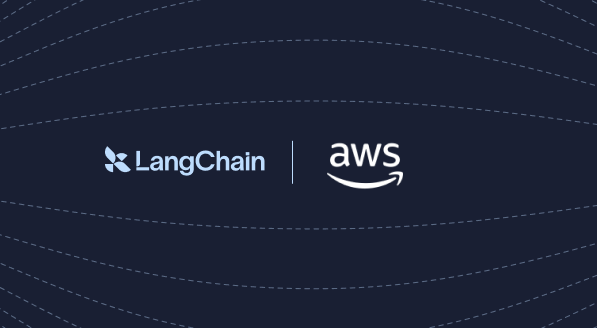

<p align="center">
  
</p>

# LangChain AWS samples

## Overview

Build agents and RAG workflows on AWS with LangChain. These samples show how to connect LangChain, LangGraph, Deep Agents, and LangSmith with AWS services such as Amazon Bedrock, Bedrock Knowledge Bases, Amazon S3, and AgentCore.

## What's inside

| Example | What it shows | Stack |
|---|---|---|
| [deepagents-aws-tour](./examples/deepagents-aws-tour) | Notebook-first tour of Deep Agents on AWS using Bedrock, Bedrock Knowledge Bases, AgentCore Code Interpreter, S3-backed state, and AWS-region LangSmith | Deep Agents + LangGraph + langchain-aws + Bedrock + LangSmith |
| [agentcore-payments](./examples/agentcore-payments) | A payment-enabled LangChain agent with automatic x402 handling, infrastructure-enforced budgets, and AWS-region LangSmith tracing | LangChain + LangGraph + langchain-aws + Bedrock + AgentCore Payments + LangSmith |

## Quickstart

Clone the repo and change into an example:

```bash
git clone https://github.com/langchain-samples/langchain-aws-samples.git
cd langchain-aws-samples/examples/<example-name>
```

From there, follow that example's own README for setup, AWS credentials, LangSmith configuration, and run commands.

## License

This project is licensed under the [MIT License](LICENSE).
